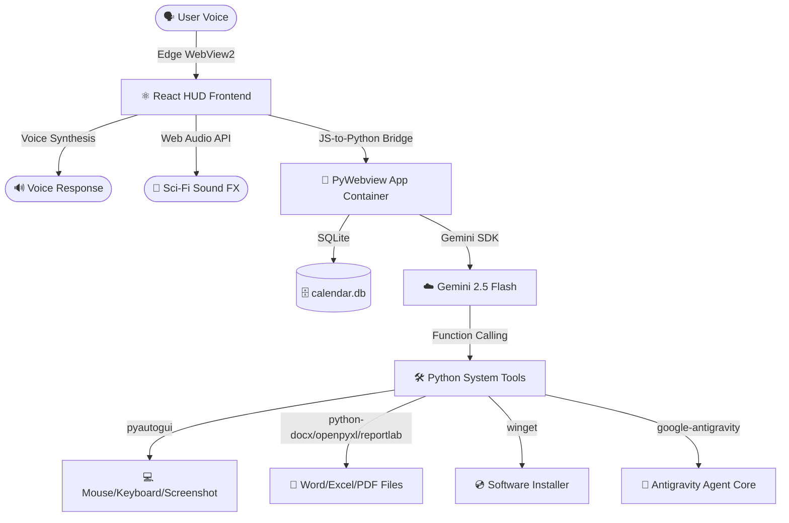

# 🖥️ Nexus JARVIS OS (v1.0)

Nexus JARVIS is a complete, lightweight, and immersive voice-controlled desktop AI assistant designed with a futuristic Iron Man-themed holographic HUD (Heads-Up Display). It combines a high-performance **React + Vite** frontend with a native **Python** backend using **pywebview**, compiling down to a single standalone Windows executable (`.exe`).

By using native browser-based Speech Recognition & Text-to-Speech (via Microsoft Edge WebView2), JARVIS achieves **near-zero CPU overhead when idle** and high-speed processing, powered by Google's cloud-based **Gemini API**.

---

## 🌟 Key Features

1. **🗣️ Multilingual Voice Control**: hands-free voice command recognition and audio feedback in 10+ languages (English, Spanish, French, German, Japanese, Hindi, Chinese, etc.) using client-side Web Speech APIs (0% local CPU load).
2. **📁 Document Generation & Management**: Creates and edits text files, Microsoft Word (`.docx`), Microsoft Excel (`.xlsx`), and PDF files directly from natural language commands.
3. **🖱️ Desktop & OS Control**: Automates keystrokes, mouse coordinates clicks, launches local programs (notepad, calculator, etc.), and takes desktop screenshots.
4. **📅 Calendar & Alarms**: SQLite-backed local scheduler and active thread alarm monitor. Triggers visual alerts, audio chimes, and voice reminders.
5. **💿 Silent Software Installer**: Downloads web files and installs software packages silently using the Windows Package Manager (`winget`).
6. **📊 Holographic Diagnostics**: Real-time dials monitoring actual host system CPU load, memory utilization, disk space, and power status using `psutil`.
7. **⚙️ Integrated Antigravity core**: Programmatic developer link that spawns an Antigravity agent (`google-antigravity` SDK) to code, debug, and manage workspace projects.
8. **🔊 Synthetic Soundscapes**: Native Web Audio API sound generator that synthesizes hover click, radar sweeps, chimes, and warning sounds (no heavy audio files required).

---

## 🏗️ System Architecture



---

## ⚙️ Prerequisites

- **OS**: Windows 10 or 11 (with Microsoft Edge WebView2 runtime installed, standard on current builds).
- **Python**: version 3.10 to 3.12 (installed in PATH).
- **Node.js**: version 18.0 or later (installed in PATH).
- **Gemini API Key**: A valid API Key from Google AI Studio.

---

## 🚀 Installation & Running

### 1. Developer Setup
Clone or copy the files to your directory. Open PowerShell inside the project directory and execute:

```powershell
# Create virtual environment and install backend libraries
python -m venv venv
venv\Scripts\pip install -r requirements.txt

# Install frontend node modules
cd frontend
npm install
npm install lucide-react
```

### 2. Run in Development Mode (Live Hot Reload)
To run the React dev server and the PyWebview application wrapper side-by-side:

```powershell
python run_dev.py
```
*Note: Make sure to click the "WAKE UP" circle to boot JARVIS and unlock the audio synthesizer.*

### 3. Build Standalone Executable (`JarvisOS.exe`)
To package the entire React build, Python scripts, databases, and assets into a single desktop executable:

```powershell
python build_exe.py
```
The compiled binary will be generated at:
📂 `dist/JarvisOS.exe`

---

## 🗣️ Voice Protocols Guide

Activate voice command mode by clicking the **central Arc Reactor** (it will glow blue/purple) and speak. Example voice commands include:

* **General**: *"JARVIS, search Google for the latest space discovery."*
* **Word files**: *"JARVIS, create a Word document called grocery.docx with a list containing milk, butter, and coffee."*
* **Excel files**: *"JARVIS, make an Excel sheet sheets.xlsx with columns Name and Age, and insert John 25, Mary 30."*
* **PDF files**: *"JARVIS, generate a PDF report.pdf titled Q2 Status and add a summary paragraph."*
* **Calendar**: *"JARVIS, schedule a meeting with Tony Stark at 2026-07-15 14:00."*
* **Alarms**: *"JARVIS, set an alarm for 09:30 tomorrow."*
* **Desktop control**: *"JARVIS, take a screenshot of my screen."* or *"Open calculator."*
* **Installation**: *"JARVIS, install Zoom."* or *"Download https://example.com/logo.png as logo.png."*
* **Developer core**: *"JARVIS, tell Antigravity to create a python web scraper script."*

---

## 🛡️ Desktop Automation Safety
* **Failsafe**: Moving your mouse cursor to any of the four corners of your screen will instantly trigger the `pyautogui` failsafe and terminate any mouse/keyboard script loops.
* **Database**: User databases (calendar events and alarms) are stored persistently in:
  `%APPDATA%/NexusJarvis/jarvis.db`

---

## 📝 License
This project is custom engineered for advanced workspace workflows and developer orchestrations. Play around, tweak the HTML/CSS/JS frontend to modify your HUD elements, or register new Python functions in `tools.py` to expand JARVIS's intelligence.
